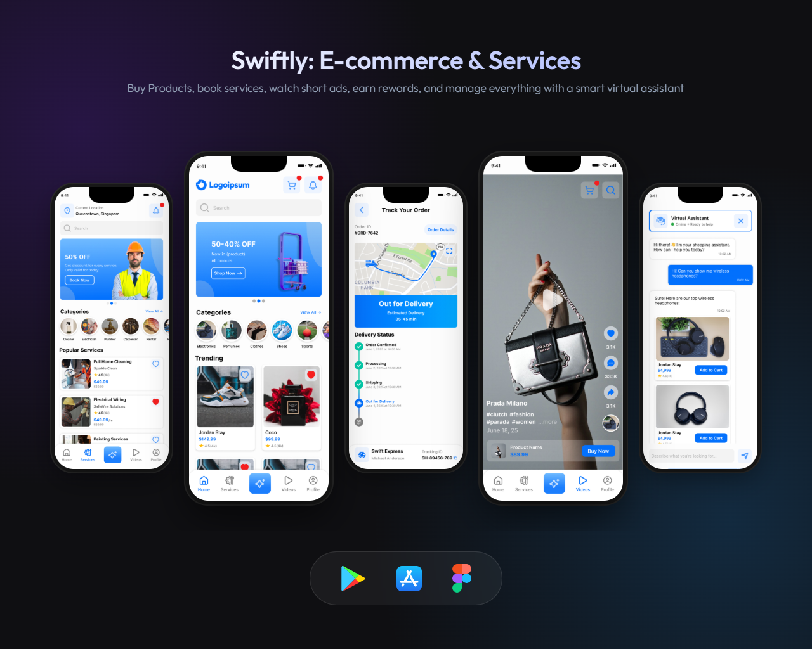

# Swiftly: E-commerce & Services
Swiftly: E-commerce & Services is an all-in-one platform that brings together e-commerce shopping, service booking, and short video advertising in a single powerful app.

In the E-commerce section, users can explore a wide range of products, place orders, track deliveries, submit reviews, request quotations, and manage their complete shopping history with ease.

The Services section enables users to book professionals for plumbing, painting, cleaning, maintenance, and many other services. Users can schedule services, track job progress, and manage bookings directly from the app.

The Video Ads section offers engaging, TikTok-style short videos that help users discover products and services in an interactive and modern way.

Users can enjoy daily games, vouchers, and rewards, personalize the app with dark mode, theme selection, and profile editing, and get instant support through a built-in Virtual Assistant. The assistant helps with order tracking, product recommendations, price comparisons, and app navigation.

Swiftly: E-commerce & Services delivers a smarter, faster, and more engaging way to shop and book services.

## 📸 Screenshots
  
  

## 🛠️ Tech Stack
- Flutter
- Firebase
- Node.js
- Stripe
- Figma
- Google Map
